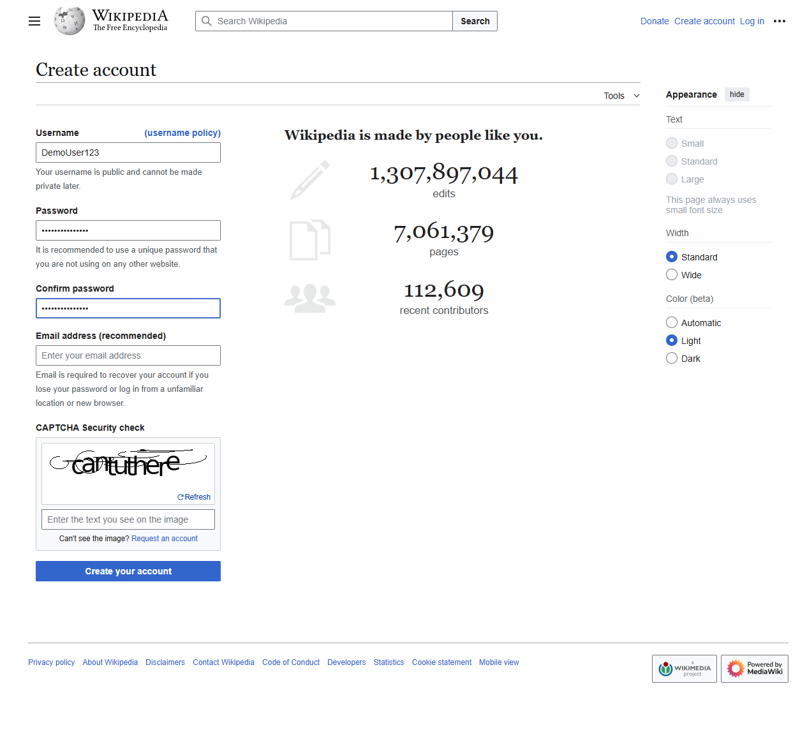

# Web Certificate Fetcher (Playwright Demo)

This project demonstrates simple web automation using [Playwright](https://playwright.dev/python/).  
The script opens a webpage, fills in form fields, captures a screenshot, and extracts live data from the page.

---

## Features
- Launches Chrome (via Playwright).
- Navigates to Wikipedia's **Create Account** page.
- Auto-fills demo form fields.
- Captures a screenshot of the filled form.
- Extracts the current total edit count from Wikipedia (`.icon-edits` element).
- Prints the extracted number in a string

---

## Example Output

py
Page loaded!
Screenshot saved as form_filled.png
There have been a total of 1,307,897,044 edits on Wikipedia!

### Screenshot Output: ###
